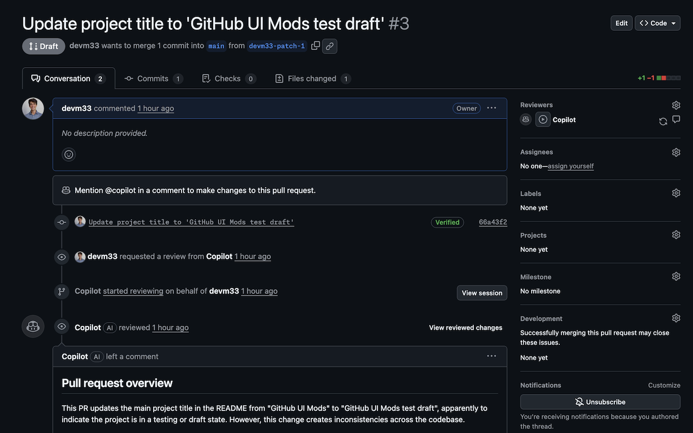

# GitHub UI Mods

A Chrome extension that adds useful modifications to the GitHub pull request interface.

https://chromewebstore.google.com/detail/github-ui-mods/fnmaeopgcjnpkimkknpeoimkdjaahfla



## Features

### 1. Copy PR Link Button
Adds a button next to the PR title that copies the PR title and link to your clipboard in the format: `PR Title: https://link-to-pr`

### 2. Request Copilot Review Button (Draft PRs)
When viewing a draft PR, adds a "Request Review" button next to the Copilot reviewer link (`/apps/copilot-pull-request-reviewer`) to easily request a review while the PR is still in draft status.

## Installation

### Load as Unpacked Extension (For Development/Testing)

1. Clone or download this repository:
   ```bash
   git clone https://github.com/devm33/github-ui-mods.git
   cd github-ui-mods
   ```

2. Open Chrome and navigate to `chrome://extensions/`

3. Enable "Developer mode" by toggling the switch in the top-right corner

4. Click "Load unpacked" button

5. Select the `github-ui-mods` directory (the one containing `manifest.json`)

6. The extension should now be installed and active!

### Verify Installation

Navigate to any GitHub pull request page. You should see:
- A "Copy PR Link" button next to the PR title
- (If it's a draft PR) A "Request Review" button next to the Copilot reviewer

## Usage

### Copy PR Link
1. Navigate to any GitHub pull request
2. Click the "Copy PR Link" button next to the PR title
3. The PR title and URL will be copied to your clipboard
4. The button will show "Copied!" briefly to confirm

### Request Copilot Review (Draft PRs)
1. Navigate to a GitHub pull request that is in draft status
2. Find the "Request Review" button next to the Copilot reviewer link
3. Click the button to request a review from Copilot
4. The button will show "Requested!" briefly to confirm

## Development

The extension consists of:
- `manifest.json` - Extension configuration
- `content.js` - Content script that modifies GitHub PR pages
- `icon*.png` - Extension icons in various sizes

To modify the extension:
1. Edit the files as needed
2. Go to `chrome://extensions/`
3. Click the refresh icon on the extension card
4. Refresh any GitHub PR pages to see your changes

## Browser Compatibility

This extension is built for Chrome (Manifest V3) but should also work in:
- Microsoft Edge
- Brave
- Other Chromium-based browsers

## License

See LICENSE file for details.
